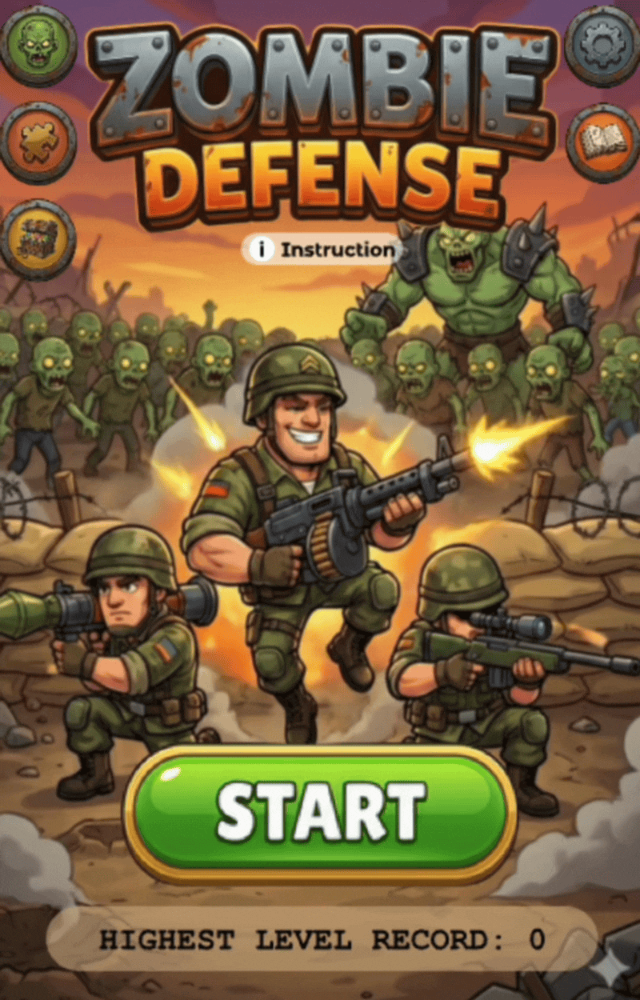
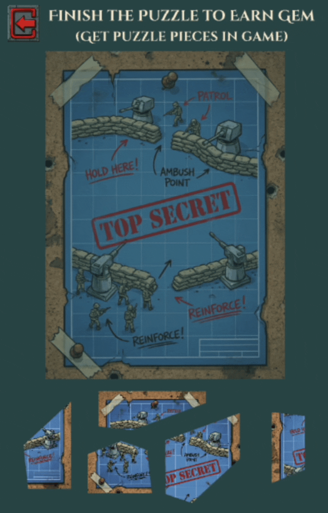
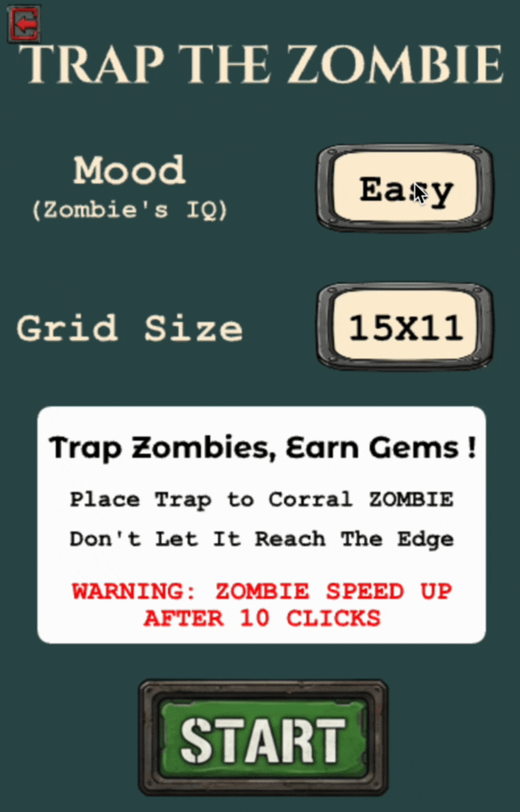
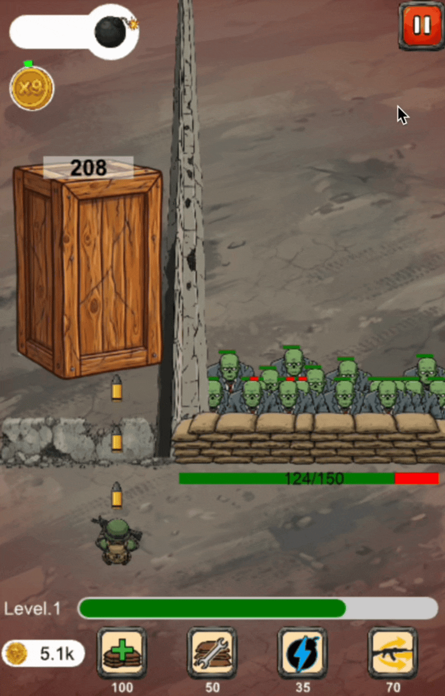

# Zombie Defense

A Python tower defense game built as my final project for Carnegie Mellon's **15-112: Fundamentals of Programming and Computer Science**, ranked **Top 8 among 400+ course submissions**.

The project combines object-oriented game architecture, graph-search algorithms, computational geometry, and real-time interactive gameplay. Players defend a wall against increasingly difficult zombie waves, purchase upgrades, and earn rewards through pathfinding and draggable puzzle minigames.

<p align="center">
  
  
  
  
  
</p>


## Technical Highlights

### Graph Search and Pathfinding

The zombie trapping minigame uses different search strategies across three difficulty levels:

- **Easy:** recursive backtracking to find a valid route through the grid
- **Medium:** recursive shortest-path search with pruning
- **Hard:** breadth-first search (BFS) using a queue and visited set to find a shortest path

These algorithms dynamically determine whether the zombie can reach the target as the player places obstacles on the board.

### Object-Oriented Game Design

The game is structured around six custom classes representing core entities:

- `Enemy`
- `Bullet`
- `Solider`
- `BonusItem`
- `ShopItem`
- `PuzzlePiece`

These classes encapsulate entity state and behavior for combat, upgrades, bonuses, and puzzle interactions, while screen-specific event handlers manage the game's different interfaces.

### Interactive Geometry

The puzzle system supports irregular draggable pieces using **ray casting for point-in-polygon detection**. This determines whether a mouse click falls inside a polygonal puzzle piece and enables selection, dragging, and snapping behavior.

### Combat and Progression Systems

The main tower defense game includes:

- Enemy waves with increasing difficulty
- Automatic shooting and real-time collision detection
- Multiple bullet and enemy types
- Bomb mechanics
- Upgrade and shop systems
- Coin and gem currencies
- Bonus items and puzzle-based rewards

## Tech Stack

- **Language:** Python
- **Graphics:** CMU Graphics
- **Programming concepts:** Object-oriented programming, recursion, breadth-first search, computational geometry, collision detection, and event-driven programming

## Run Locally

### Requirements

- Python 3.11–3.14
- Desktop display
- Internet connection for externally hosted game assets

Clone the repository:

```bash
git clone https://github.com/T-ya777/zombie_defense.git
cd zombie_defense
```

Create and activate a virtual environment:

```bash
python3 -m venv .venv
source .venv/bin/activate
```

Install dependencies and run the game:

```bash
python -m pip install -r requirements.txt
python main.py
```

On Windows, use `py` instead of `python3` and activate the environment with:

```bash
.venv\Scripts\activate
```

If CMU Graphics requires platform-specific setup, see the [official CMU Graphics installation instructions](https://academy.cs.cmu.edu/desktop).

## Controls

- Use the **mouse** to navigate menus, purchase upgrades, and select bonuses.
- Use the **Left / Right arrow keys** to move soldiers; shooting is automatic.
- Click grid cells to place obstacles in the zombie trapping minigame.
- Drag collected puzzle pieces into their correct positions.
- Use the in-game instructions for additional gameplay mechanics and the settings menu for audio controls.

## Project Structure

```text
zombie_defense/
├── main.py
├── requirements.txt
└── README.md
```

`main.py` contains the game classes, algorithms, screen handlers, and gameplay logic.

Images and audio are hosted in a separate [asset repository](https://github.com/T-ya777/112FinalProjectSource), preserving the structure of the original course project.

## Compatibility

Tested with **Python 3.14.3** and **CMU Graphics 2.0.3** on macOS. Because game assets are hosted separately, an internet connection is required during gameplay.

## Credits

Created for **Carnegie Mellon University 15-112: Fundamentals of Programming and Computer Science** using Python and CMU Graphics.

- Images generated with Gemini
- Music generated with Suno
- Sound effects sourced from Freesound
- Algorithm references and AI assistance are acknowledged in the source comments
